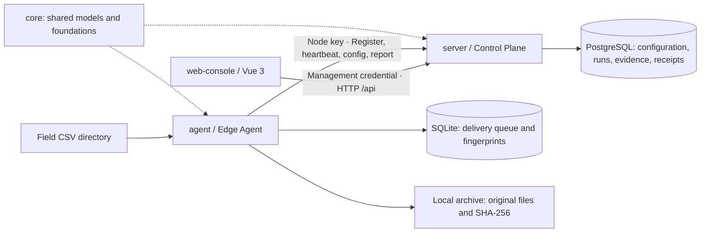
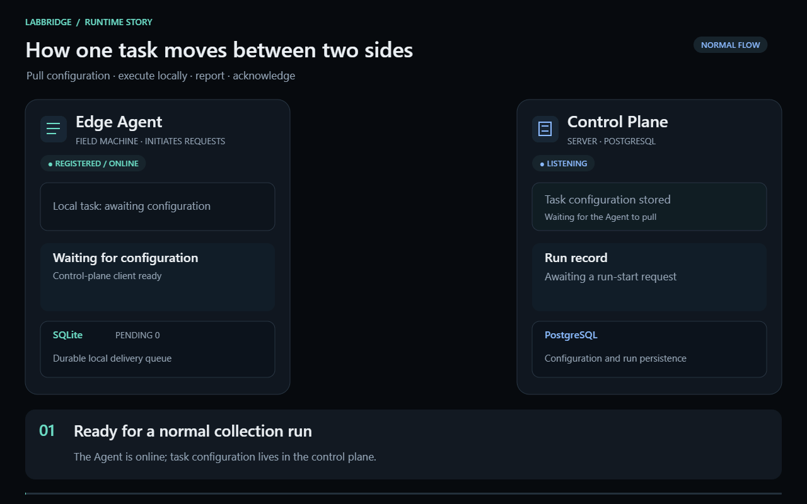

<div align="center">

# LabBridge

### Turn field data into a traceable chain of evidence.

A privately deployed data ingestion, quality control and archival platform for laboratories, monitoring stations and small industrial sites.

[简体中文](README.md) · **English**


[Background](#background) · [Modules](#modules-and-connections) · [Runtime](#how-it-runs) · [Demo](#console-demo) · [Get the source](#get-the-source) · [Quick start](#quick-start)

</div>

## Background

An instrument exports CSV files, a field computer runs a collection script, and another system stores the results. Finding out when a measurement was collected, whether anything was missed, why it failed validation and where its original file lives can require manual investigation across all three. Network interruptions and duplicate uploads make that harder.

LabBridge brings this workflow into one privately deployed system. A central control plane manages nodes and collection tasks. Field agents connect to it, collect and validate data, and link original files to structured results. Each run can be traced through its raw files, parsed records, quality checks and alerts.

Typical uses include laboratory instrument exports, environmental monitoring observations and periodic file collection at small industrial sites. The focus is **collect → parse → validate → archive → reliably report → query and investigate**. Full LIMS workflows, general-purpose ETL orchestration and large-scale stream processing are outside the current scope.

### What you can try

- **Scheduled collection**: automatically read CSV data from a local directory.
- **Quality checks**: check required data and timestamp formats, with alerts for failures.
- **Raw-file archival**: retain originals and trace results back to their source.
- **Run tracking**: view node status, collection tasks and run history in the console.
- **Issue investigation**: inspect parsed records, QC results and linked alerts.
- **Offline recovery**: persist registered jobs in SQLite and resume delivery after restart or reconnection.
- **Deployment and operations**: central Compose configuration, a Linux Agent systemd template, and inspection, backup and recovery drill tools.

**Status: early MVP with an authenticated demo, now undergoing deployment and operations validation for small, controlled internal networks.** Backup/recovery and upgrade/rollback drills have been run; real power-loss recovery, systemd host restarts and offline installation on a new machine remain unverified. FTP, Oracle, MinIO/object storage and comprehensive management pages are not yet complete. HTTP and static credentials are used today, with the demo bound to loopback by default; configure HTTPS before connecting over untrusted networks.

## Development environment and requirements

- **Development OS**: WSL2 Ubuntu 24.04.
- **Compiler**: GCC/G++ 13 with C++17.
- **Build tools**: CMake and Ninja.
- **Demo environment**: Linux / WSL2 with Docker Engine and Compose; no local compilation needed.

## Modules and connections



### What each module does

| Directory / module | Responsibility and collaboration |
| --- | --- |
| `core/` | Shared stable models, result types, logging and foundations give Agent and Server a common vocabulary. |
| `agent/bootstrap` | Reads YAML, loads the node credential, creates control-plane clients and handles startup and handshake boundaries. |
| `agent/runtime` | Coordinates heartbeats, configuration refresh, worker threads and shutdown. |
| `agent/scheduler` | Decides when to run tasks using downloaded configuration and Cron expressions. |
| `agent/collectors` | Discovers and reads input files under allowed local roots. |
| `agent/parsers` | Converts observation CSV into structured records and records parsing outcomes. |
| `agent/qc` | Applies configured rules and produces traceable quality results. |
| `agent/execution` | Connects collection, raw-file archival, manifest delivery and result reporting into one execution. |
| `agent/storage` | Persists delivery stages, retry content and processed-file fingerprints in SQLite for recovery after restart. |
| `server/http` | Uses Drogon for authentication, request DTOs and uniform responses, then delegates to request executors. |
| `server/application` | Validates business operations and coordinates management and queries through repository ports. |
| `server/include/labbridge/server/repositories` | Defines storage interfaces that separate business logic from database implementation. |
| `server/postgres` | Implements libpq sessions, SQL mapping, repositories and request transactions, including evidence and idempotency receipts. |
| `web-console/` | Provides credential entry and node/task/run queries using same-origin `/api` requests. |
| `deploy/` | Full schema for new databases, incremental migrations for existing databases, sample configurations and Compose orchestration. |
| `scripts/demo/` | Creates isolated demo tasks, validates API results and checks PostgreSQL, SQLite and archive hashes. |
| `tests/`, `cmake/` | Existing unit, component, contract and real PostgreSQL tests, plus build support. |

The HTTP path is `route → controller → request executor → application service → repository`. Business rules live in the application layer; PostgreSQL handles transactions and persistence. The browser never accesses the database directly. Agents initiate outbound connections to the control plane, so field machines do not need an inbound HTTP endpoint for central polling.

## How it runs



[Static frame](docs/assets/readme/runtime-flow.en.png) · [Download the interactive HTML animation](docs/assets/readme/runtime-animation.html) and open it locally to pause, seek or switch languages.

The Agent stays on the left and the control plane on the right. Arrows appear only during a request or response, a task card travels back with the response, and arrows disappear when the exchange finishes. Starting with an already registered Agent, the animation illustrates a successful run with passing QC. Its 36 seconds are compressed narration, not measured execution time.

1. **Pull:** the Agent initiates a configuration request; the center reads the assigned task and sends a task card back in its response.
2. **Start:** the local Cron scheduler triggers a run-start request, and the center returns the run ID.
3. **Archive locally:** the Agent collects and archives the CSV, persisting file state and pending delivery content in SQLite.
4. **Link the file:** the Agent sends the manifest; the center commits the metadata and returns `raw_file_ids` for subsequent records.
5. **Process and report:** the Agent parses the archived CSV, performs QC, persists the report and sends the records and QC results. The center commits the transaction and durable receipt.
6. **Acknowledge:** after the successful response, the Agent completes and clears the pending item. The local original remains archived and central evidence is queryable. Manifest and report are separate transactions.

```text
node → data source → task → task run
                             ├─ raw file → parsed records → QC results
                             └─ alerts
```

Raw files currently remain in the **Agent's local archive**. The Server stores paths, hashes and related metadata. `archived_local` does not mean the file has been uploaded to central object storage.

## Console demo


A sequence of real screenshots from this repository's local demo: nodes → tasks → runs → evidence drawer → quality results → alerts. Credential entry is omitted. IDs and timestamps belong to that recorded run. The application UI is currently Chinese; the language switch applies to this README.

[Nodes](docs/assets/readme/console-nodes.png) · [Tasks](docs/assets/readme/console-tasks.png) · [Runs](docs/assets/readme/console-runs.png) · [Raw evidence](docs/assets/readme/console-evidence.png) · [QC](docs/assets/readme/console-qc.png) · [Alerts](docs/assets/readme/console-alerts.png)

## Get the source

```bash
git clone https://github.com/Augustzero/LabBridge.git
cd LabBridge
```

## Quick start

With Linux / WSL2, Docker Engine, Compose v2 and OpenSSL ready, run from the repository root:

```bash
bash scripts/demo/run.sh
```

Open [http://127.0.0.1:8080/nodes](http://127.0.0.1:8080/nodes) and sign in with the management token shown by:

```bash
cat "${LABBRIDGE_DEMO_AUTH_DIR:-$HOME/.local/state/labbridge/demo-auth}/management.token"
```

Stop the demo and keep its data:

```bash
bash scripts/demo/stop.sh
```

## Deployment and operations

The deployment baseline is Ubuntu 24.04 x86_64, with Docker Compose at the center and Linux Agents at each site:

- **Center**: [Compose configuration](deploy/production/compose.yaml) and [environment template](deploy/env/production.env.example), with persistent database storage and credentials kept outside the repository.
- **Field Agent**: [systemd service template](deploy/systemd/labbridge-agent.service) and [packaging script](scripts/ops/package-agent.sh).
- **Maintenance**: [inspection](scripts/ops/check.sh), [center backup](scripts/ops/backup-center.sh), [Agent backup](scripts/ops/backup-agent.sh) and [isolated drills](scripts/ops/drill.sh).

Backups require a coordinated maintenance window with writes stopped, preserving the center data and each Agent's queue, archive and input files in the same batch. Offline recovery covers registered jobs; new cycles after an offline restart still require a connection to the center, and source files must be retained at the site.

## Contribute

Share bugs and suggestions through [Issues](https://github.com/Augustzero/LabBridge/issues).

**License:** the repository currently has no `LICENSE` file. Contact the maintainer to confirm authorization before use or redistribution.
