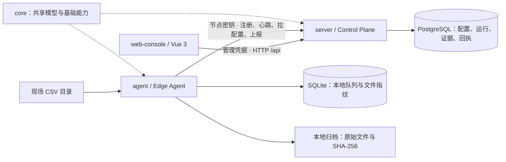
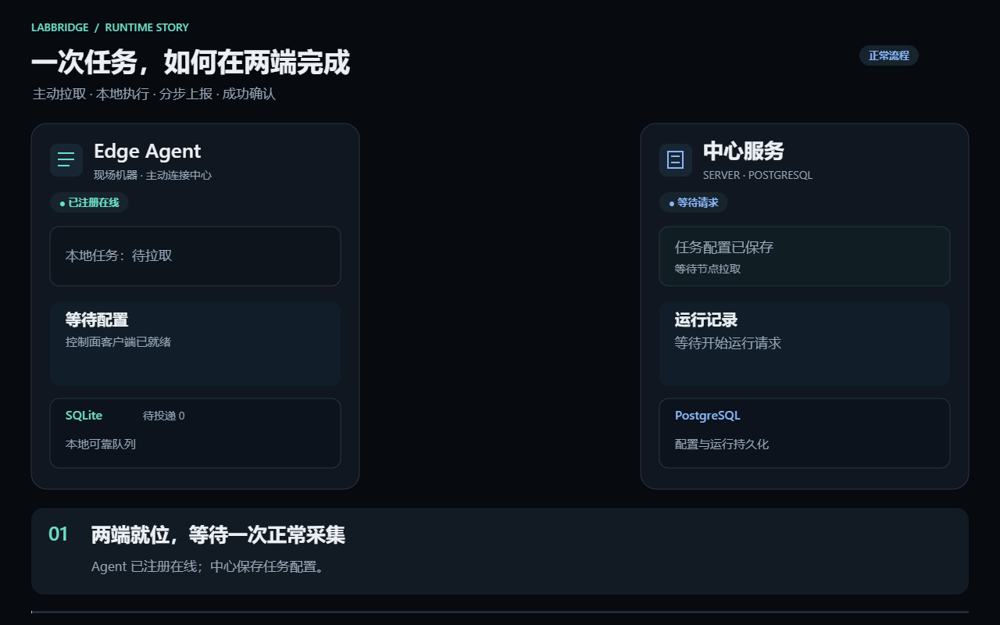
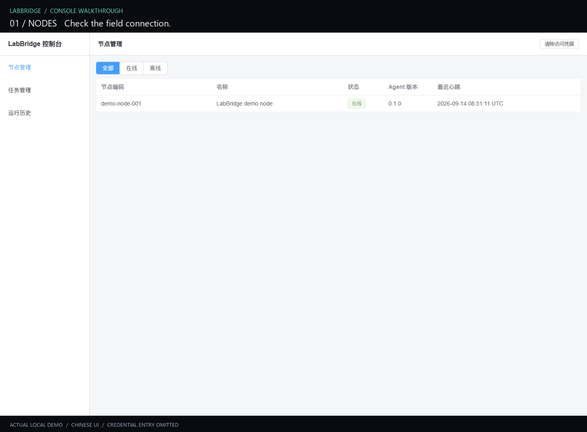

<div align="center">

# LabBridge

### 把现场数据，连成可追溯的证据链。

面向实验室、监测站与小型工业现场的私有化数据接入、质控与归档平台。

**简体中文** · [English](README.en.md)


[项目背景](#项目背景) · [模块与联系](#模块与联系) · [运行过程](#运行过程) · [页面演示](#页面演示) · [获取源码](#获取源码) · [快速体验](#快速体验)

</div>

## 项目背景

一台仪器输出 CSV，一台现场电脑运行采集脚本，另一个系统负责保存结果。数据虽然产生了，但“什么时候采的、有没有漏、为什么异常、原文件在哪”往往需要人工逐处排查。网络中断和重复上传又让这些问题更加复杂。

LabBridge 将这条分散的工作链路收拢到一套可私有部署的系统中：中心端管理节点与采集任务，现场 Agent 主动连接中心、执行采集与质控，并把原始文件和结构化结果关联起来。用户可以从一次运行追到原始文件、解析记录、质控结果和告警。

适用场景包括实验室仪器数据归集、环境监测站观测文件接入，以及小型工业现场的周期性文件采集。它专注于**采集 → 解析 → 质控 → 归档 → 可靠上报 → 查询追踪**，当前不覆盖完整 LIMS 流程、通用 ETL 编排或大型实时计算。

### 当前可以体验什么

- **定时采集**：自动读取现场目录中的 CSV 数据。
- **数据质控**：检查数据完整性和时间格式，发现异常并生成告警。
- **原始文件归档**：保留原文件，方便从处理结果追溯数据来源。
- **运行追踪**：在控制台查看节点状态、采集任务和运行历史。
- **问题排查**：查看解析记录、质控结果和关联告警。
- **断网恢复**：暂存未完成的上报，网络恢复后继续投递。

**状态：早期 MVP，已形成带认证的单机演示闭环。** FTP、Oracle、MinIO/对象存储、完整管理页面和生产运维能力尚未完成。当前演示使用 HTTP 与静态凭据，仅监听本机回环地址，适合本机评估；生产部署还需 TLS、凭据运维、备份恢复等工作。

## 开发环境与环境要求

- **开发系统**：WSL2 Ubuntu 24.04。
- **编译器**：GCC/G++ 13，使用 C++。
- **构建工具**：CMake、Ninja。
- **Demo 环境**：Linux / WSL2，安装 Docker Engine 与 Compose 即可，无需本机编译。

## 模块与联系



## 运行过程



[静态画面](docs/assets/readme/runtime-flow.png) · [下载交互动画 HTML](docs/assets/readme/runtime-animation.html)（本机打开，可暂停、拖动进度、中英切换）。

当前原文件保存在 **Agent 的本地归档**；Server 保存路径、哈希和关联元数据。不能把 `archived_local` 理解为原文件已经上传到中心对象存储。

## 页面演示



来自本仓库本机演示的真实页面截图序列，展示“节点 → 任务 → 运行 → 证据抽屉 → 质控 → 告警”。已省略凭据输入；画面中的运行编号和时间仅为该次演示数据。当前控制台界面为中文，中英文切换针对本说明文档。

[节点原图](docs/assets/readme/console-nodes.png) · [任务原图](docs/assets/readme/console-tasks.png) · [运行原图](docs/assets/readme/console-runs.png) · [证据原图](docs/assets/readme/console-evidence.png) · [质控原图](docs/assets/readme/console-qc.png) · [告警原图](docs/assets/readme/console-alerts.png)

## 获取源码

```bash
git clone https://github.com/Augustzero/LabBridge.git
cd LabBridge
```

## 快速体验

准备 Linux / WSL2、Docker Engine、Compose v2 和 OpenSSL，在仓库根目录执行：

```bash
bash scripts/demo/run.sh
```

打开 [http://127.0.0.1:8080/nodes](http://127.0.0.1:8080/nodes)，使用以下命令显示的管理凭据登录：

```bash
cat "${LABBRIDGE_DEMO_AUTH_DIR:-$HOME/.local/state/labbridge/demo-auth}/management.token"
```

停止演示（保留数据）：

```bash
bash scripts/demo/stop.sh
```

## 参与贡献

欢迎通过 [Issues](https://github.com/Augustzero/LabBridge/issues) 反馈问题和建议。

**许可证：** 当前仓库未附 `LICENSE` 文件；使用或再分发前请联系维护者确认授权。
